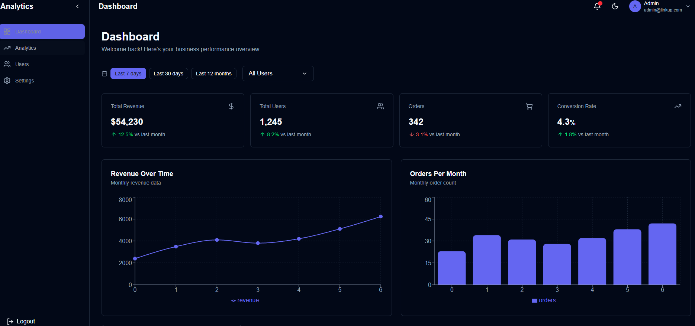
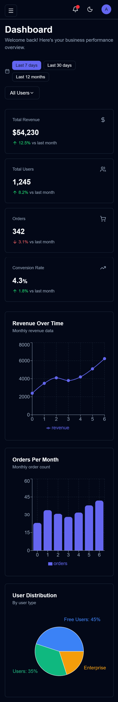

<div align="center">
  <br />
      
  <br />
</div>

# Admin Analytics Dashboard

A production-focused **Admin Analytics Dashboard** built as part of a **Software Engineering Internship (Frontend)** assignment.  
The project demonstrates real-world frontend practices including reusable components, state management, responsive layout, data visualization, and mock backend integration.

---

## Live Preview

> This project uses **JSON Server** as a mock backend, so a single live deployment is not required.  
> Please follow the setup instructions below to run the project locally.

---

## Features Overview

### Core Features
- Responsive **Admin Dashboard Layout**
- Collapsible **Sidebar Navigation**
- Sticky **Header** with theme toggle
- **KPI Cards** with growth indicators
- Interactive **Charts** (Line, Bar, Pie)
- Global **Dark / Light Theme**
- Fully responsive (Desktop, Tablet, Mobile)

### Dashboard Sections
- **Total Revenue**
- **Total Users**
- **Orders**
- **Conversion Rate**
- Revenue Over Time (Line Chart)
- Orders Per Month (Bar Chart)
- User Distribution (Pie Chart)

### Filters & Interactions
- Date range filter:
  - Last 7 days
  - Last 30 days
  - Last 12 months
- User type filter:
  - All
  - Free
  - Premium
  - Enterprise

---

## Tech Stack

### Frontend
- **Next.js** (App Router)
- **TypeScript**
- **Tailwind CSS**
- **Recharts** (Data Visualization)
- **Zustand** (State Management)
- **pnpm** (Package Manager)

### Mock Backend
- **JSON Server**
- REST-style endpoints:
  - `/kpis`
  - `/revenue`
  - `/orders`
  - `/users`

---

## Project Structure
```bash
src/
├── app/
│ ├── layout.tsx # Root layout
│ ├── page.tsx # Dashboard page
│ └── globals.css
│
├── components/
│ ├── layout/ # Sidebar, Header
│ ├── dashboard/ # KPI cards, charts, filters
│ └── shared/ # Theme provider, utilities
│
├── lib/
│ ├── api.ts # API helpers
│ ├── mock-data.ts # Data logic & helpers
│ └── types.ts # Shared TypeScript types
│
├── store/
│ └── dashboard.store.ts # Zustand global store
│
└── hooks/
└── custom hooks
```
---

## Setup Instructions

### 1.Clone the Repository
```bash
git clone https://github.com/devtanzir/analytics-dashboard.git
cd analytics-dashboard
```
### 2.Install Dependencies
```bash
pnpm install
```

### 3.Run JSON Server (Mock Backend)
```bash
pnpm json-server --watch db.json --port 4000
```
The mock API will be available at:
```bash
http://localhost:4000
```
### 4.Run the Frontend App
```bash
pnpm dev
```

Open:
```bash
http://localhost:3000
``` 

---

## Data Flow & State Management

- Global filters (date range, user type) are handled via Zustand
- Charts and KPI cards reactively update based on store state
- API data is fetched from JSON Server
- UI remains decoupled from data logic for easy scalability

## UI / UX Decisions

- Clean spacing and consistent typography
- Tailwind utility-first styling
- Accessible color contrast for dark & light modes
- Hover states and subtle transitions
- Mobile-first responsive layout

## Performance Considerations

- Memoized chart components
- Minimal global state
- Avoided unnecessary re-renders
- Responsive containers for charts
- Clean component boundaries

## Assumptions Made

- Authentication was not required
- Backend was mocked using JSON Server
- Focus was on frontend architecture and UX
- CSV export and role-based access were optional and excluded

## Screenshots





## Notes for Reviewers

- This project was built with production-ready structure in mind
- Easy to replace JSON Server with a real backend
- Designed to scale with additional dashboard modules
- Code emphasizes readability and maintainability

## Author

Tanzir Ibne Ali

- **Github:** [GitHub](https://github.com/devtanzir/)
- **Portfolio:** [tanziribneali.vercel.app](https://tanziribneali.vercel.app)
- **LinkedIn:** [linkedin.com/in/tanziribneali](https://www.linkedin.com/in/tanziribneali/)